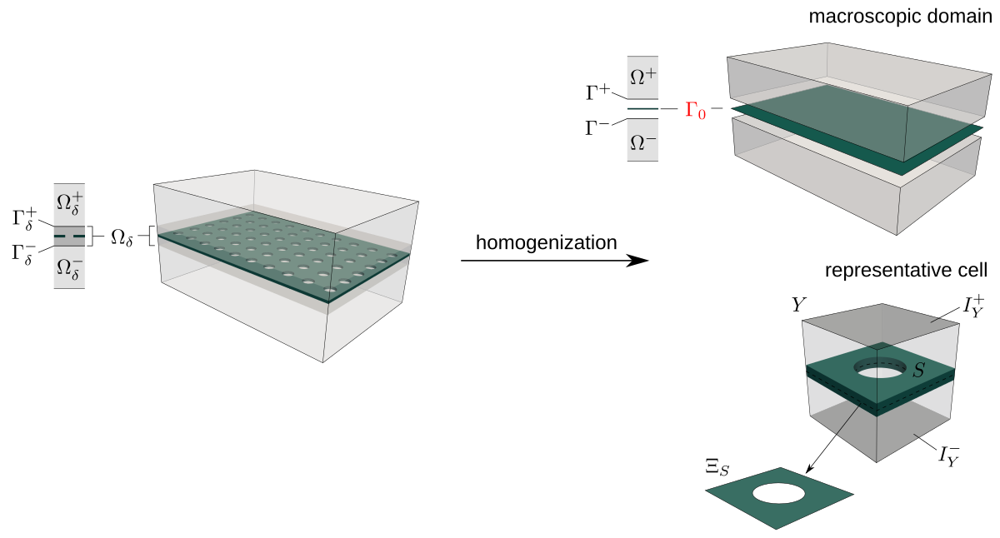
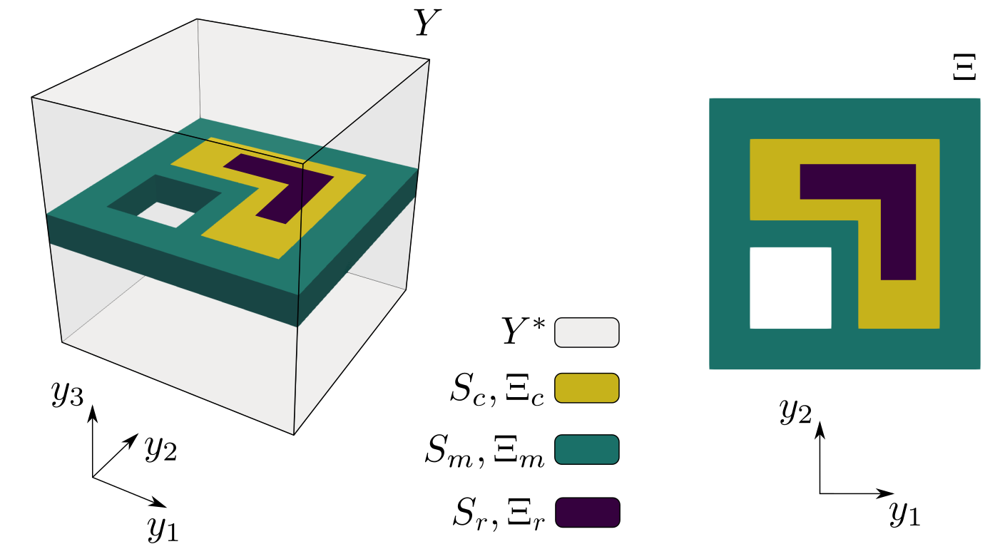
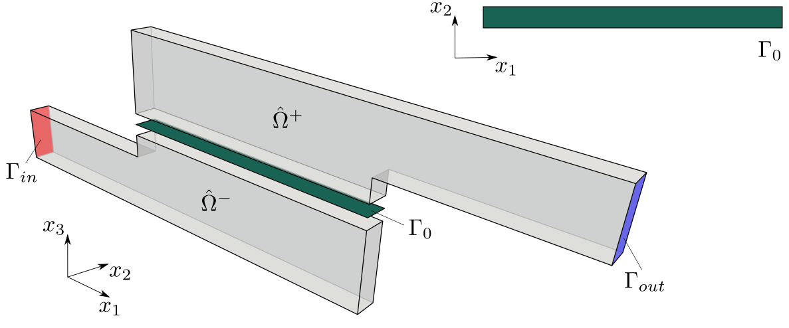
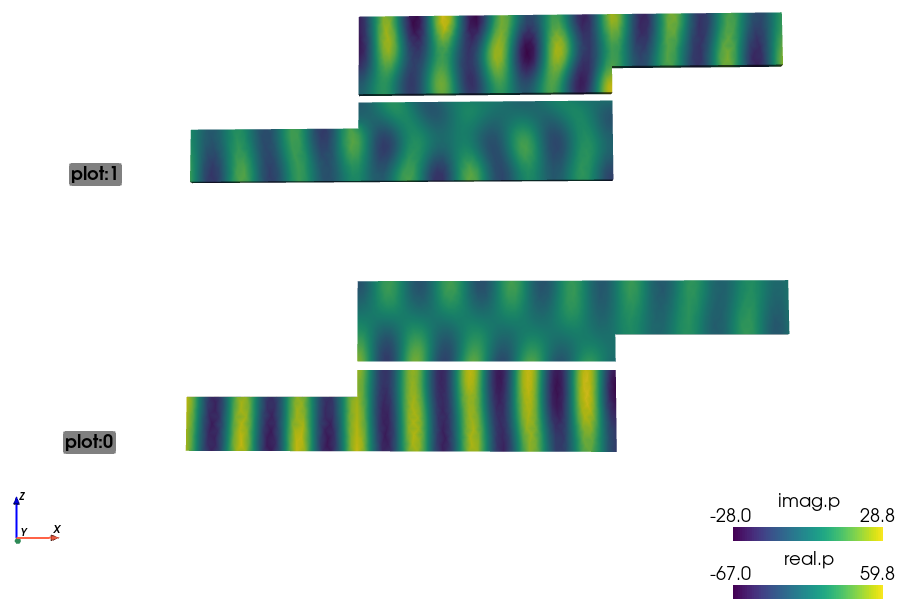
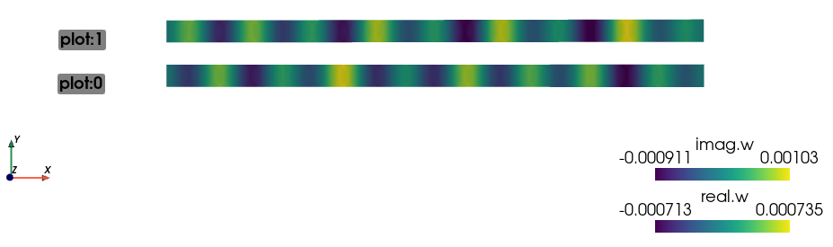

.. toctree::
   :maxdepth: 2
   :caption: Contents:

Homogenization of the vibro-acoustic transmission on perforated plates with embedded resonators 
===============================================================================================

Mathematical model
------------------

This example presents the implementation of the homogenized model of the
acoustic transmission on perforated plates described in [RohanLukes2021]_. The
elastic plate interacting with an inviscid fluid is replaced by an interface on
which the homogenized transmission conditions are applied, see
:numref:`fig_homog`.

.. _fig_homog:

   Transmission layer :math:`\Omega_\delta` of thickness :math:`\delta` embedded in
   the global domain :math:`\Omega_G = \Omega_\delta \cup \Omega^+_\delta \cup
   \Omega^-_\delta` is replaced by the homogenized interface :math:`\Gamma_0`. The solid
   part :math:`S` of the representative cell :math:`Y` corresponds to the perforated plate.

The frequency dependent homogenized coefficients are computed using
characteristic responses of the representative cell which consists of the fluid
part :math:`Y^\ast` and the solid plate :math:`S_m, \Xi_m` embedding the
elastic inclusion :math:`S_c, \Xi_c` and the resonator :math:`S_r, \Xi_r` as
illustrated in :numref:`fig_micro`.

.. _fig_micro:

   The computational domains :math:`Y` and :math:`\Xi` involved in the calculations
   of the characteristic responses and the homogenized coefficients.

Equations describing the homogenized transmission layer involve the homogenized
coefficients and are solved in the macroscopic domain :math:`\Gamma_0` and are
coupled with the global acoustic field defined in :math:`\Omega^+ \cup
\Omega^-`.

Numerical implementation
------------------------

The problem of homogenized coefficients and the global macroscopic equations
are discretized and solved by means of the finite element method. The frequency
dependent coefficients are defined in :code:`acoustics_micro.py` and the
frequency independent coefficients calculated within the 2D plate
representation :math:`\Xi` are specified in :code:`acoustics_micro_plate.py`.
The homogenization engine of SfePy, see [CimrmanLukesRohan2019]_, is employed
for their effective calculation.

At the macroscopic level, we consider the waveguide which domain is divided by
the perforated plate into two parts of the same shape and size, see
:numref:`fig_macro`. The waveguide input is labelled by :math:`\Gamma_{in}` and the
incident wave is imposed on this boundary. The anechoic boundary condition is
considered at the waveguide output which is labelled by :math:`\Gamma_{out}`.
The definition of the macroscopic problem is in files
:code:`acoustics_macro.py` and :code:`acoustics_macro_plate.py`. The first file
specifies the equations and variables related to :math:`\Omega^+`,
:math:`\Omega^-` while the second one defines the equations associated with the
homogenized interface :math:`\Gamma_0`.

.. _fig_macro:

   The computational domains :math:`\Omega^+`, :math:`\Omega^-`,
   :math:`\Gamma_0` employed in the numerical simulations of the acoustic
   transmission at the global (macroscopic) level.

The whole two-scale analysis is govern by the :code:`acoustics.py` script which
invokes the homogenization procedures and runs the simulation at the
macroscopic level.

Running simulation
------------------

To run the numerical simulation, download the
`archive <https://github.com/sfepy/example_vibroacoustics/archive/v2.zip>`_,
unpack it in the main SfePy directory and type:

.. code::

   python example_vibroacoustics-2/acoustics.py

   
By running the :code:`resview.py` script, you can visualize the distribution of
the global pressure field calculated for frequency :math:`\omega = 33000` Hz:

.. code::
   
   ./resview.py example_vibroacoustics-2/results/waveguide_mesh_w33000_p.vtk -v "270,90"

   Distribution of the macroscopic pressure in the macroscopic domain
   :math:`\Omega^+ \cup \Omega^-`.

and e.g. the deflection field calculated at the interface :math:`\Gamma_0`:

.. code::
   
   ./resview.py example_vibroacoustics-2/results/waveguide_mesh_w33000_dp0.vtk -v "0,0" --position-vector "0,2,0" -f real.w:p0 imag.w:p1
   

   Distribution of the plate deflection in the macroscopic domain :math:`\Gamma_0`.

References
----------

.. [RohanLukes2021] Rohan E., Lukeš V.
   Homogenization of the vibro-acoustic transmission on periodically perforated
   elastic plates with arrays of resonators.
   Applied Mathematical Modelling, 2022,
   `DOI:10.1016/j.apm.2022.05.040 <https://doi.org/10.1016/j.apm.2022.05.040>`_
.. [CimrmanLukesRohan2019] Cimrman R., Lukeš V., Rohan E.
   Multiscale finite element calculations in Python using SfePy.
   Advances in Computational Mathematics, 45(4):1897-1921, 2019,
   `DOI:10.1007/s10444-019-09666-0 <https://doi.org/10.1007/s10444-019-09666-0>`_

